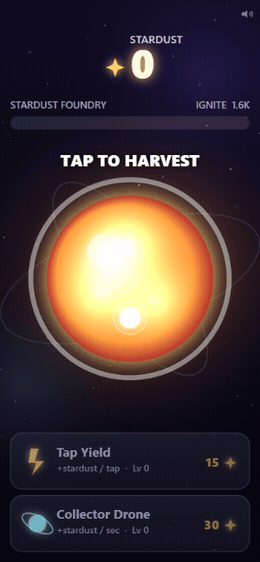
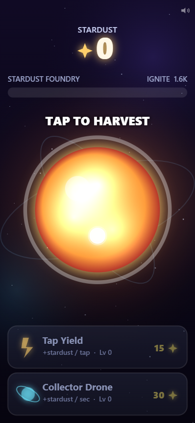
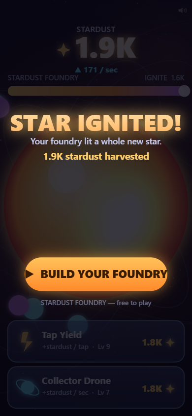

# Playable Ads — self-contained HTML5 prototypes

Original **playable-ad** prototypes built to demonstrate the interactive ad-network
format: each ad is a single, self-contained `index.html` — pure HTML5 + Canvas +
vanilla JS, **no engine, no external runtime, no network requests**. Tap/click-driven,
mobile-first, ~15–30 s of gameplay ending in an **install CTA**.

**Live:** https://arcsymer.github.io/playable-ads/

| Ad | Genre | Status | Live link | Size |
|----|-------|--------|-----------|------|
| **GLYPHFALL** | Match-3 (aurora runes) | ✅ Live | [play](https://arcsymer.github.io/playable-ads/match3/) | **31 KB** |
| **STARDUST FOUNDRY** | Clicker / Idle (tap-to-earn) | ✅ Live | [play](https://arcsymer.github.io/playable-ads/clicker/) | **29 KB** |
| **PRISM POUR** | Puzzle (colour-sort) | ✅ Live | [play](https://arcsymer.github.io/playable-ads/puzzle/) | **29 KB** |
| **NOVA NOODLES** | Tycoon / Management | ✅ Live | [play](https://arcsymer.github.io/playable-ads/tycoon/) | **35 KB** |

> These are **original prototypes to show the format**, not shipped campaigns. The
> operator has 5 Unity games + a TS/JS core stack but no prior shipped playable ads —
> this repo demonstrates the single-file, weight-budgeted, tap-to-CTA discipline the
> format needs. No fabricated install metrics or client claims.

---

## What is a playable ad?

An ad you can *play*. It runs inside an ad container (MRAID) in an app, gives a few
seconds of real gameplay, then shows an **Install / Play the full game** button that
deep-links to the store. The hard constraints are what make it a specialized craft:

- **One file, self-contained.** No CDN, no external assets — everything inlined or
  generated so it works the instant the container loads.
- **Tiny.** Networks enforce a hard weight budget (commonly ~2–5 MB). Every KB counts.
- **Can't get stuck.** Guided first move, auto-hint on inactivity, no soft-lock, always
  reaches the CTA.
- **Any screen, touch-first.** Portrait *and* landscape, phone-sized, large tap targets.

## GLYPHFALL (match-3) — live


Swap adjacent glowing runes to make lines of 3+; matches pop, tiles cascade, and chained
clears build a **combo multiplier** that fills the "charge" bar. Hit the goal → end card
→ install CTA.

- **Six original runes** — distinct *shape and* colour (colour-blind friendly), all drawn
  procedurally on Canvas. No image or audio files anywhere.
- **Juice:** particle bursts, screen shake, floating `+score`, combo call-outs, an
  animated progress bar, Web-Audio SFX generated at runtime.
- **Guided & unstuck:** an animated hand shows the first suggested swap; after a few idle
  seconds a hint pulses; if the board runs out of moves it reshuffles.
- **Weight:** the entire ad is **~31 KB** in one HTML file — ~150× under the 5 MB ceiling.

<p align="center"> </p>

### Tech

Vanilla HTML5 / Canvas 2D / JS in a single file. Responsive full-viewport canvas
(devicePixelRatio-aware), a fixed-timestep-ish game loop with delta time, a pointer layer
that unifies mouse + touch (swipe *or* tap-tap), and a small state machine
(play → resolve cascades → win → end card). Art is procedural, audio is Web-Audio
generated — so there are **no assets to inline** and the file stays tiny.

### Ad-network integration

The store redirect and MRAID hook live at the bottom of
[`match3/index.html`](match3/index.html):

```js
// Networks (AppLovin, ironSource, Unity Ads, Mintegral…) inject the store URL at serve
// time. Prefer MRAID when present; fall back to window.open so it also runs standalone.
function redirect(url) {
  url = url || STORE_URL;                        // STORE_URL = network macro placeholder
  if (typeof mraid !== "undefined" && mraid.open) { mraid.open(url); return; }
  window.open(url, "_blank");                     // standalone / double-click fallback
}
```

That's the whole integration surface: swap `STORE_URL` for the network's macro and the
CTA is wired.

## STARDUST FOUNDRY (clicker / idle) — live



Tap the reactor core to harvest **Stardust**; spend it on two upgrades that both
*visibly change the scene* — **Tap Yield** (each tap earns more) and **Collector
Drones** (passive income, each drone appears orbiting the core). The per-second rate
accelerates, the core grows and gains rings, the counter rolls up in abbreviated
big-number form (`1.2K`, `1.8M`)… until you cross the **ignite** threshold → the star
goes supernova → install CTA. Engaged play ignites in **~18 s**.

- **The macro-over-micro loop, compressed:** tap → earn → upgrade → numbers accelerate →
  milestone, in one screen.
- **Juice:** floating `+N`, stardust motes that fly toward the counter, screen shake, a
  rolling counter, an ignite flash + particle supernova, Web-Audio SFX with a rising
  tap-pitch.
- **Guided & unstuck:** an animated "TAP TO HARVEST" hand on the core; affordable
  upgrades pulse on their own to pull you into the loop; a stronger hint after a few idle
  seconds. Tapping always earns, so it can't soft-lock.
- **Weight:** **~29 KB**, one HTML file, no assets.

<p align="center"> </p>

> **Genre note:** this one is a **clicker / idle** ad (tap one object → upgrades → number
> grows), not a management tycoon. It lives at `/clicker/`. The real manage-a-venue tycoon
> is **NOVA NOODLES** below.

Same single-file Canvas skeleton as GLYPHFALL (responsive DPR canvas, delta-time loop,
unified pointer input, state machine, procedural art, Web-Audio SFX) and the same MRAID /
`redirect()` hook at the bottom of [`clicker/index.html`](clicker/index.html).

## PRISM POUR (puzzle) — live


A **colour-sort** puzzle: tap a crystal vial, then another, to pour the top run of
glowing light-essence across — legal only onto a matching colour (or an empty vial).
Sort every vial to a single pure colour to solve. Two short levels (3 then 4 colours),
then the install CTA.

- **Provably never stuck.** Each level is *generated then verified solvable* by a built-in
  BFS solver before it's shown. That same solver drives the animated **guided first move**
  and the **inactivity hint** (recomputed from the *current* board, so it's always a real
  solving move) — plus an **Undo** to back out of any dead-end. It cannot soft-lock.
- **Accessible:** each colour carries a distinct **emblem** (circle / triangle / square /
  diamond), so it reads by shape as well as hue.
- **Juice:** lifting/pouring vial animation with an arcing stream, a "seal" flare + chime
  when a vial is completed, a level-clear flourish, particle finish, Web-Audio SFX.
- **Weight:** **~29 KB**, one HTML file, no assets.

<p align="center"> </p>

Same single-file Canvas skeleton and the same MRAID / `redirect()` hook at the bottom of
[`puzzle/index.html`](puzzle/index.html).

## NOVA NOODLES (tycoon) — live · *the real management tycoon*


A genuine **manage-a-venue tycoon** (not a clicker): run a little space noodle stand.
Travellers queue up, your **woks auto-cook** bowls, you **tap a ready wok to serve** the
front traveller for coins — then **spend coins to grow the operation**: build more woks or
cook faster. Throughput visibly rises as the stand expands, until you hit the milestone →
**BUSINESS BOOMING!** → install CTA. Engaged play gets there in **~26 s** (typically
growing to ~3 woks + 2 speed upgrades). See [`tycoon/DESIGN.md`](tycoon/DESIGN.md).

- **A real business loop**, compressed: queue fills → serve → earn → **build/upgrade** →
  throughput rises → milestone. The satisfaction is *growing a stand*, not tapping one
  object. The core decision is the classic **expand vs improve** trade-off (New Wok vs
  Faster Cook).
- **Guided & unstuck:** an animated "SERVE!" pointer on the first ready wok, then affordable
  upgrades that pull you in; an inactivity auto-hint. There's **no fail state and no timer**
  — the queue just grows and woks always keep cooking, so it can't soft-lock.
- **Juice:** cute alien travellers sliding in/out with want-bubbles, wok cooking rings +
  steam, a bowl arc-flying to each traveller, floating `+coins`, a rolling coin counter, a
  "NEW WOK!" / "FASTER!" flash + particles, and a served/target progress bar.
- **Weight:** **~35 KB** — more logic than the other ads (a queue, parallel stations, an
  economy), still one HTML file with no assets, ~140× under the 5 MB ceiling.

<p align="center"> </p>

Same single-file Canvas skeleton and the same MRAID / `redirect()` hook at the bottom of
[`tycoon/index.html`](tycoon/index.html).

> **Clicker vs tycoon:** [STARDUST FOUNDRY](#stardust-foundry-clicker--idle--live) (at
> `/clicker/`) is the tap-one-object *clicker/idle* ad; **NOVA NOODLES** here (at
> `/tycoon/`) is the *management* tycoon — place/upgrade stations and run a venue.

## Run it locally

Each ad is one file — **just double-click `match3/index.html`** (no server needed).
To serve the whole hub:

```bash
npx serve .        # or: python -m http.server
# then open http://localhost:3000/match3/
```

## Honest scope note

"Playable-ready" here means **builds + runs correctly in a browser, portrait and
landscape, reaching the CTA under budget** — verified on desktop Chrome via automated
playthrough. The final "hooks in the first 2 s / feels right in the hand / passes a
specific network's spec" judgment is a human check on a real device. Say so, don't fake it.

## License

MIT — see [LICENSE](LICENSE). Original IP; genre mechanics are free to use, no real game's
characters, art, or brand are copied.
